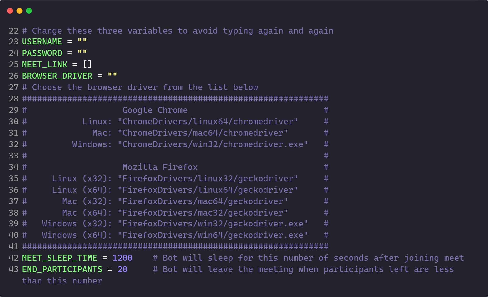

#

## Index

- [Index](#index)
- [Description](#description)
- [Features](#features)
- [How to use](#how-to-use)
- [Tips to use MeetGod Easily and Efficiently](#tips-to-use-meetgod-easily-and-efficiently)
- [How MeetGod works behind the scenes](#how-meetgod-works-behind-the-scenes)
- [Dependencies](#dependencies)

## Description

A cross-platform super dope tool that attends Google Meet meetings for you while you are sleeping or doing some other work. MeetGod handles everything for you flawlessly


## Features

- Easy to use.
- Schedules the meetings and joins automatically on time.
- Automatically disables camera and microphone and mutes the browser
- Sorts the meetings schedule with respect to time.
- You can add, remove, modify any meeting that is scheduled
- Has a user-friendly menu.
- Sleeps for a certain amount of time at the start of the meeting (20 mins by default).
- Leaves the meeting when the number of students are less than a particular value (20 by default).
- All the functions are performed on a seperate thread so you can interact with the bot even when it is in a meeting or waiting for one.
- Supported platforms: Windows, Mac and Linux.
- Supported Browsers: Google Chrome and Firefox.
- Automatically check for the MeetGod updates and notifies the user whenever an update is available.

## How to use

1. Clone this repository or download it as a .zip file (and extract its contents).
2. Install all the requirements by navigating into the MeetGod folder and running the following command in the terminal.

   For windows users:

   ```
   pip install -r requirements.txt
   ```

   For macos/linux users:

   ```
   pip3 install -r requirements.txt
   ```

3. Run the `Bot.py` file from the terminal using the following command and rest will be taken care by the bot

   For windows users:

   ```
   python Bot.py
   ```

   For macos/linux users:

   ```
   python3 Bot.py
   ```

4. [Note] Make sure you have either Chrome or Firefox installed

## Tips to use MeetGod Easily and Efficiently

Even though everything will be taken care when the Bot.py is executed, still here are some variables that you can fill before running the Bot.py so that you don't have to type the details again and again when the bot is ran multiple times

1. Enter you username/email in the `USERNAME` variable on line 23
2. Enter your password in the `PASSWORD` variable on line 24
3. Enter the meet link and the time to join the meet(in 24 hour format) as one string in the list variable `MEET_LINK` on line 25. For example: `MEET_LINK = ["https://meet.google.com/uza-jkad-qwe 10:30:00", "https://meet.google.com/qwe-dsds-fio 16:00:00"]`
4. Choose the browser driver based on your system and browser and put it in the `BROWSER_DRIVER` variable on line 26 (Take help from the list given below the variable)
5. By default the bot sleeps for 20 mins after entering the meeting and then starts checking if the meeting has ended. You can change the default sleeping time by changing the `MEET_SLEEP_TIME` variable on line 41. (By default 1200secs = 20mins)
6. After the bot finishes sleeping for the certain amount of time as mentioned in the above point, it regularly checks for the number of participants in the meetings and leaves when their number is less than a particular value (20 by default). You can change this value by changing the varibale `END_PARTICIPANTS` on line 42



## How MeetGod works behind the scenes

If no variables are changed, as discussed [tips](#tips-to-use-meetgod-easily-and-efficiently), then upon execution, it prompts user to provide all the details (email, password, meeting's schedule and browser information). Else if variables are changed by the user, then it straight away starts the meeting process.

It first sorts all the meetings provided by the user (with respect to time), then it starts a new thread that calculates the time between the next meeting and sleeps for that amount of time. When the meeting has started, it navigates to the meeting's link, disables camera and microphone, mutes the browser and then joins the meeting. After joining the meeting it sleeps for a certain amount of time (20 mins by default) and then starts checking the number of people present in the meet periodically. If at some point, the number of people present in the meet is less than a certain value (20 by default), then it leaves the meeting and starts the whole process again for the next meeting (if any).

Since the process mentioned above is happening on a different thread, you can still control the bot and pass various commands (as mentioned in the main menu), even if it's waiting for a meeting or attending one, and it follow all your orders. You can make the bot end the meeting (if any), modify any meeting's link or time, delete any meeting, add more meetings (even after all the meetings in the schedule are over) and see the current bot status (i.e. waiting for meeting, in meetings, idol)

## Dependencies

These are the dependencies that will be installed from the `requirements.txt` file

- **selenium** (for browser automation)
- **datetime** (for scheduling)
- **termcolor** (for various colour outputs)
- **requests** (for cheking for MeetGod Updates)
